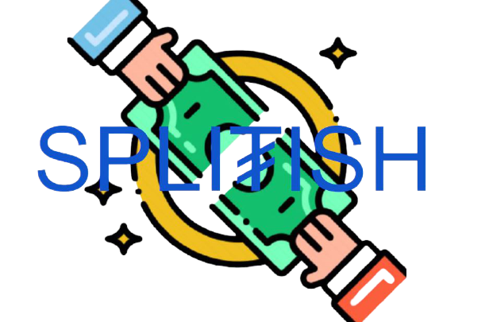
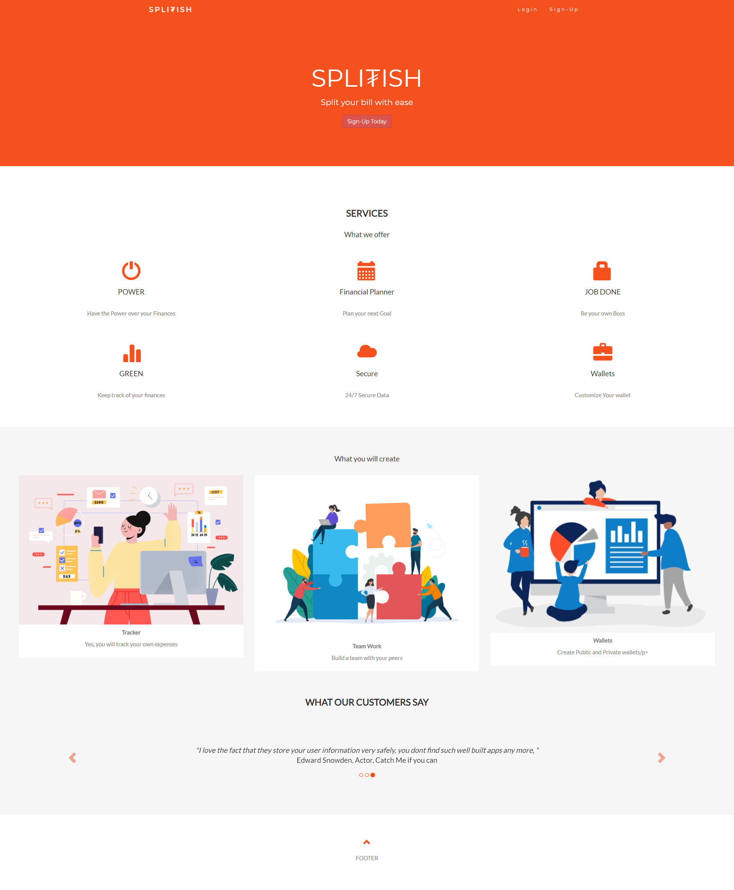
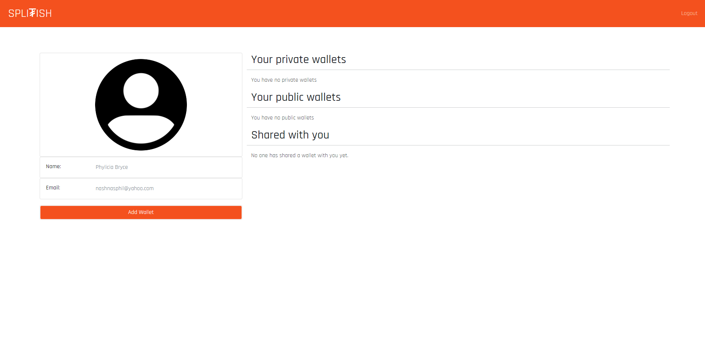
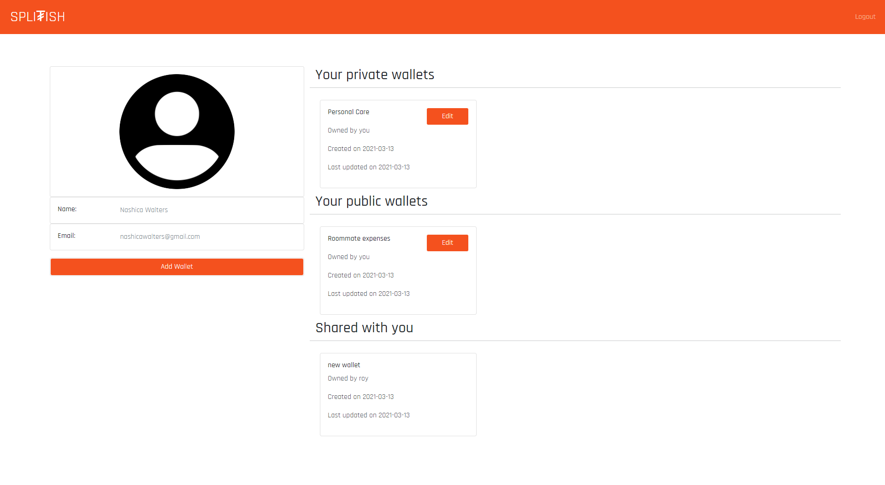
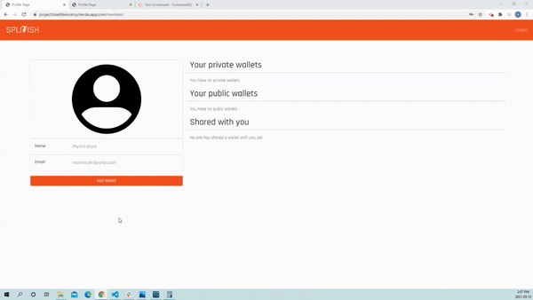
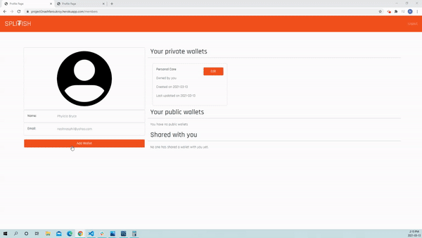
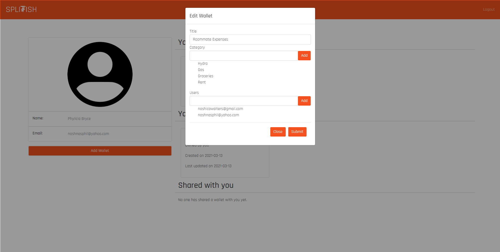

<p align="center"> 

</p>

<p align="center">
 <a href=""></a>
 <a href=""></a>
 <a href=""></a>
 <a href=""></a>
</p>

## Table of Contents
* [Description](#description)
    * [User Story](#user-story)
* [Technologies](#technologies)
* [Usage](#usage)
    * [Deployment and Demo](#deployment-and-demo)
    * [Screenshots](#screenshots)
    * [Tips](#tips)
* [Contributors](#contributors)
* [Contributing](#contributing)
* [License](#license)

## Description

You are enjoying a pleasant evening of food, drinks, and great conversation with a group of friends. Everything is going smoothly until your server presents a bill, and you realize you forgot to ask for separate bills.

SplitIsh is a cost sharing app that helps its users to monitor their finances by allowing them to split bills with friends, family, roommates etc. A new wallet can be created, an expense added and the group can decide how to split the bill.  The app also allows its users to track their expenses, spending and budgeting. 

### User Story:
```
User Story
As a young adult 
I want to be able to easily share costs and track my expenses and spending
So that I can stay on top of my finances
```
```
Given a wallet app
When I create a new account and/or log in
Then I am able to view my user profile and a list of the wallets I created (public/shared and private)
When I create a new wallet
Then I am able give the wallet a name, add a category and invite participants
When I view an available/existing wallet
Then I am able to view a list of expenses by name, amount, date and paid by 
When I add a new expense in a wallet
Then I am able to to give the expense a name, add the amount, category of the expense, descritption, date, paid by and allocate the share distribution of the expense 
When I edit an expense
Then I am able to edit the name , amount, description, category, date, paid by and the share distribution % owed
When I edit a wallet
Then I am able to edit the name of the wallet, add categories and invite/remove participants.

```
## Technologies

* [Bootstrap](https://getbootstrap.com/)/[CSS3](https://www.w3schools.com/css/default.asp)/[HTML5](https://www.w3schools.com/html/)
* [JQuery](https://jquery.com/)
* [Git](https://git-scm.com/)/[GitHub](https://github.com/features)
* [Node.js](https://nodejs.org/en/)
* [Express.js](https://expressjs.com/)
* [Express-session](https://www.npmjs.com/package/express-session)
* [Bcrypt.js](https://www.npmjs.com/package/bcryptjs)
* [Handlebars](https://handlebarsjs.com/)
* [Heroku](https://www.heroku.com/)
* [MySQL](https://dev.mysql.com/doc/)
* [Sequelize ORM](https://sequelize.org/)
* [Nodemailer](https://thisdavej.com/node-js-sending-email-notifications-using-nodemailer-and-gmail/) (email invites/notification)

## Usage
A first time user needs to sign up to access the app. Once the sign up is complete, the user is re-directed to the user profile page. This page displays the user's name, email and area to display wallets. If the user has already signed up, they are able to log in and access the user profile page.

The wallets are displayed in three categories:
1. Private wallets - This a wallet that was created and no users were added. Only the logged in user can access the information.

2. Public wallets- This is a wallet that the logged in user created and add users to. Users are added by entering an email address for people you want to add to the wallet.

3. Shared wallets- This is a wallet created by another user and you were invited. This wallet type cannot be edited.

The logged in user is able to add a wallet by providing a wallet name, categories, select the wallet status(public or private) and add users (enter email address for person/ persons you want to add) to the wallet. Email invitations will be sent to the users to sign up. 

Once a wallet is created the user is able to edit or view the wallet. To edit a wallet, click on the edit button on the the wallet. If the wallet is private, only the category can be edited. If the wallet is a public wallet, the user is able add more categories and invite more users. Please note that the user is not able to delete any of the information when making edits.

To view a wallet, the user clicks on the wallet card. A private wallet will only display the logged in users name. If the wallet is pblic or shared all the users (once they have have an account), will be displayed in the shares section. The users are able to add expenses. When the expense infomation is filled in and submitted, the expense is shown in the expense section, by title, category, date and paid by. The total section and breakdown by categories areas are also populated. The users are able to edit expenses that they enter by clicking on the expense.

The users are able to settle up if they own money. A new expense is created, the user fills out the relevant information and the category settling balance is selected. In the split shares section, ensure that the user user value for the person you need to pay is one(1) and the other user value is zero(0)(This step is not neccessary in a private wallet). Please note at the time their might be some discrepancies in the amount owed as the share is split by percentage. For example, if the shares on an expense were split 0.33. This something we hope to fix in the future.


### Deployment and Demo
Heroku was used for app deployment.

Click [here](https://project2nashfaroukroy.herokuapp.com/) to deploy.

### Screenshots
<p align= "center">

</p>

### Click on the arrows to drop down more images of the app.

<details>
  <summary>Profile Page with and without wallets</summary>
  
  
</details>
<details>
  <summary>Adding and editing wallets</summary>
  
  
  
</details>
<details>
  <summary>Adding and editing expenses</summary>
  
</details>
<details>
  <summary>Settling expenses</summary>
  
</details>

### Tips
1. You are able to clone this repo or download a zip file to your local machine.
2. If you have cloned a repo and a package.json exists, you are able to see the dependencies and dev dependecies used in the application. If this is the case run the below comand to get all the depencies need for that application.
```
$ npm i
```
3. When using Heroku to deploy your app ensure that your `package.json` file is set up correctly. It must have a `start` script and all the project's dependencies defined. E.g.:
```
  },
     "scripts": {
       "start": "node server.js"
     }
   }
```
## Contributors
* Roy Atallah- [https://github.com/R-A-exe](https://github.com/R-A-exe)
* Nashica Walters- [https://github.com/nashwalters](https://github.com/nashwalters)
* Farouk Kisuule- [https://github.com/Farouk994](https://github.com/Farouk994)

## Contributing
Please first discuss the change you wish to make via issue or email, before making a change. See [Contributors](#contributors) section for links to our github profiles with email information.

Steps to contribute:
1. Fork the repo on GitHub.
2. Clone the project to your own machine.
3. Commit changes to your own branch.
4. Push your work back up to your fork/branch.
5. Submit a Pull Request so that we can review your changes.


## License 
Copyright © 2021

